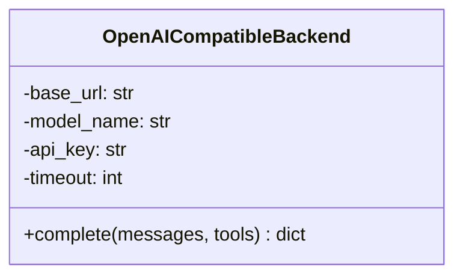
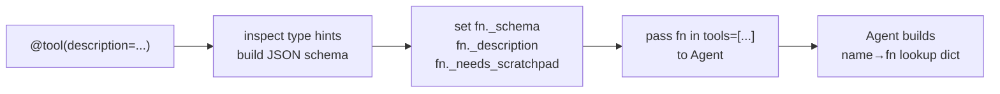
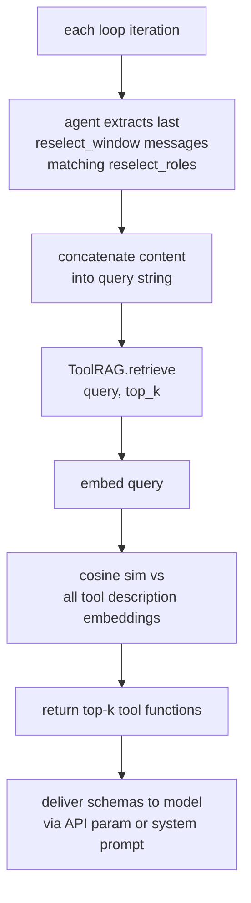
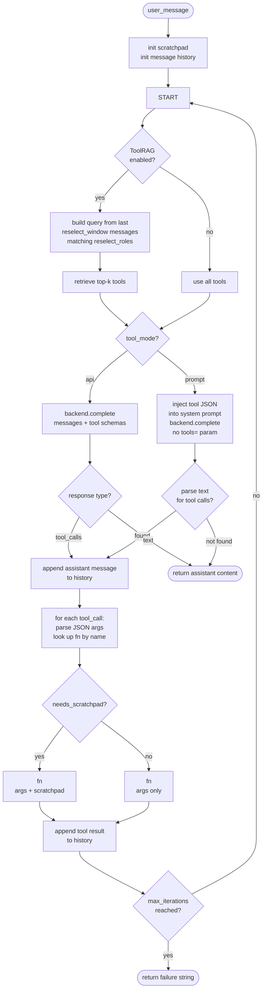
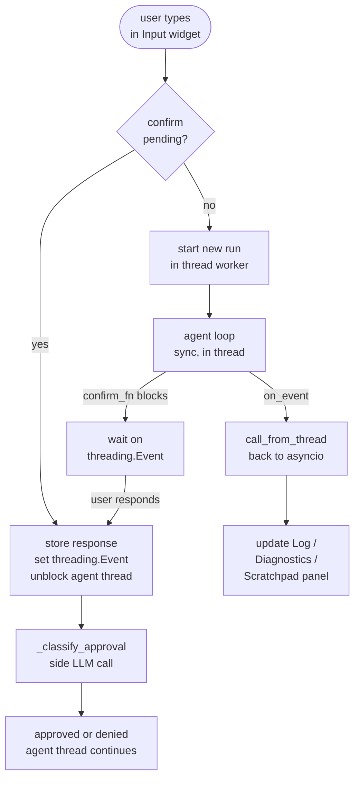

# uniagent — Technical Specification

## 1. Goals

- Minimal Python repo (~500–800 lines of core)
- Single config entry point (`config.yaml`)
- Runs anywhere Python runs: laptop, Jetson, server
- Pluggable model backends (OpenAI API, Ollama, llama.cpp)
- Tools registered via decorator; schemas auto-generated from type hints
- Optional ToolRAG: retrieve top-k relevant tools per query
- Scratchpad: shared dict per run, injected into tools that request it
- Optional HITL: human-in-the-loop tool confirmation with natural-language approval via the same model
- Optional token streaming: emit tokens via `on_event` as they arrive for real-time display or TTS
- Optional speech pipeline: VAD → STT → agent → TTS, interface-agnostic, configured via `config_speech.yaml`
- Optional debug TUI: Textual-based terminal UI, zero cost when not used

---

## 2. Repo Structure

```
uniagent/
├── uniagent/
│   ├── __init__.py      # public API: Agent, tool, load_config
│   ├── agent.py         # core loop
│   ├── tool.py          # @tool decorator
│   ├── model.py         # backend abstraction
│   ├── toolrag.py       # optional tool retrieval
│   ├── tui.py           # optional debug TUI (requires textual)
│   ├── speech/          # optional speech package (requires pywhispercpp, silero-vad, piper-tts)
│   │   ├── __init__.py
│   │   ├── pipeline.py
│   │   ├── audio.py
│   │   ├── vad.py
│   │   ├── stt.py
│   │   ├── tts.py
│   │   ├── config.py
│   │   ├── types.py
│   │   └── errors.py
│   └── packs/
│       ├── __init__.py
│       └── system.py    # shell, fs, http primitives
├── config.yaml
├── config_speech.yaml
├── examples/
│   ├── basic.py
│   ├── tui_basic.py
│   └── speech_basic.py
├── tests/
│   ├── test_agent.py
│   ├── test_speech.py
│   └── test_tui.py
├── scripts/
│   ├── speech_harness.py
│   └── speech_pipeline_harness.py
└── pyproject.toml
```

**Code size guidance:** keep core modules compact and split optional speech adapters by responsibility.

---

## 3. config.yaml — Full Schema

```yaml
model:
  backend: ollama          # ollama | llamacpp | openai
  base_url: http://localhost:11434/v1
  model_name: gemma4:e2b
  api_key: null            # required for openai; arbitrary string for ollama/llamacpp
  timeout: 60              # seconds
  tool_mode: api           # api    — native OpenAI tools= param; model returns structured tool_calls
                           # prompt — tools injected as JSON in system prompt; model returns JSON array
                           # lfm    — tools injected as list in system prompt; model returns <|tool_call_start|> tokens (LFM2.5)
  temperature: null        # null = model default; lower (0.0–0.3) improves tool calling reliability
  max_tokens: null         # null = model default; set to cap response length
  seed: null               # null = random; set to an integer for reproducible outputs
  stream: false            # set true to emit tokens via on_event as they arrive

agent:
  max_iterations: 10       # hard cap on think→act cycles per run
  system_prompt: "You are a helpful assistant."
  confirm_tools: false     # set true to require human approval before each tool call

toolrag:
  enabled: true
  top_k: 5
  backend: tfidf           # tfidf | sentence-transformers
  st_model: null           # e.g. "all-MiniLM-L6-v2" if backend is sentence-transformers
  reselect_window: 3       # number of recent messages to use as retrieval query each iteration
  reselect_roles: [user, assistant]  # which message roles to include in the query

scratchpad:
  enabled: true
```

All fields have defaults; partial configs are valid.

---

## 4. Components

### 4.1 `model.py` — Backend

One concrete backend covers all three providers. All expose the same `/v1/chat/completions` HTTP API — only `base_url`, `model_name`, and `api_key` differ.

```python
class OpenAICompatibleBackend:
    def __init__(
        self,
        base_url: str, model_name: str, api_key: str, timeout: int,
        temperature: float | None, max_tokens: int | None, seed: int | None,
    ): ...
    def complete(
        self,
        messages: list[dict],
        tools: list[dict],
        on_token: Callable[[str, float], None] | None = None,
    ) -> dict: ...
```

Implemented using the `openai` Python SDK with `base_url` overridden. The agent only requires a backend-like object with a compatible `complete()` method.

**`on_token` callback** — signature `Callable[[str, float], None]`: receives `(token_text, running_tok_per_sec)`. When provided, `complete()` dispatches to `_complete_streaming()`; otherwise `_complete_blocking()`. The return value is the same message dict shape in both paths.

`_complete_blocking()` — existing non-streaming path, no changes to behaviour.

`_complete_streaming()` — iterates `stream=True` chunks manually (no SDK internal helpers, for cross-version stability):
- Content tokens: call `on_token(tok, tps)` per chunk, concatenate into `content`
- Running `tok_per_sec`: computed from the streaming cadence while chunks arrive; final usage is taken from backend usage when provided and otherwise remains approximate
- Tool call deltas: accumulated silently per `index` into `tool_call_accum` dict; never passed to `on_token`
- Returns same dict shape as blocking path; `_stats` populated from final `usage` if available, else from chunk count + wall time

**Streaming accumulation** is done manually (no SDK internal helpers) for stability across SDK versions:
- Content tokens: concatenate into `message["content"]`
- Tool call deltas: accumulate per `index`, reconstruct full `tool_calls` list at stream end
- `_stats` dict populated from the final chunk's `usage` field when available; falls back to chunk-count approximation

The return value of `complete()` is the raw message dict from the SDK, extended with a private `_stats` key:

```python
msg["_stats"] = {
    "completion_tokens": int,
    "latency_ms": float,
}
```

`_stats` is popped by the agent loop before the message is appended to history.

**`tool_mode`** controls how tool schemas are delivered to the model:

- `api` (default) — schemas sent via the `tools=` parameter of the chat completions API. The model returns structured `tool_calls` in the response. A 400 from the backend is a hard error — no fallback.
- `prompt` — schemas serialized as JSON and appended to the system prompt. The `tools=` parameter is never sent. The model is instructed to respond with a JSON array; the agent parses it from plain text.
- `lfm` — for LFM2.5 and similar models. Tool list injected into the system prompt as `List of tools: {json}`. The model responds using native `<|tool_call_start|>[fn(kwarg=val)]<|tool_call_end|>` tokens, which the agent parses via `ast.parse`.

In `prompt` mode the system message becomes:

```
{system_prompt}

You have access to the following tools:
{json.dumps(tool_schemas, indent=2)}

To call tools, respond ONLY with a JSON array:
[{"tool": "tool_name", "args": {"param": "value"}}, ...]

To give a final answer without calling tools, respond in plain text.
```

In `lfm` mode:

```
{system_prompt}

List of tools: {json.dumps(tool_schemas, indent=2)}
```



---

### 4.2 `tool.py` — Tool System

**`@tool` decorator** attaches metadata directly onto the function as attributes. No registry object — users pass a plain `list` of decorated functions to `Agent`.

```python
@tool(description="Add two numbers")
def add(a: int, b: int) -> str:
    return str(a + b)

agent = Agent.from_config(config, tools=[add])
```

Internally, `Agent` builds `{fn.__name__: fn for fn in tools}` — that is the entire "registry."

**Schema auto-generation** from type hints using a fixed mapping:

| Python type | JSON schema type |
|---|---|
| `str` | `"string"` |
| `int` | `"integer"` |
| `float` | `"number"` |
| `bool` | `"boolean"` |
| `dict` | `"object"` |
| `list` | `"array"` |

For anything outside this table, `@tool` accepts an explicit `schema` kwarg that replaces auto-generation entirely.

**Scratchpad injection:** If a tool's signature includes `scratchpad: dict`, the harness detects this via `inspect.signature` at call time and injects the current run's scratchpad. `scratchpad` is omitted from the model-facing JSON schema; it is an internal dependency, not an argument the model supplies. Tools without it are unaffected.

**Attributes set on the function by `@tool`:**

```python
fn._description: str
fn._schema: dict        # OpenAI-format function schema
fn._needs_scratchpad: bool
```



---

### 4.3 `toolrag.py` — Tool Retrieval

Reduces prompt size and hallucination by sending only the top-k most relevant tool schemas per query.

**Lifecycle:**
1. **Init:** embed all tool descriptions once, store as a matrix
2. **Query:** called on every loop iteration. The agent extracts the last `reselect_window` messages whose `role` is in `reselect_roles`, concatenates their `content`, and passes that as the query string. Cosine similarity is computed against all tool descriptions; top-k functions are returned.
3. **Fallback:** if ToolRAG is disabled or the agent has ≤ k tools, return all tools unchanged

**Two retrieval backends:**

| Backend | Deps | Notes |
|---|---|---|
| `tfidf` | `numpy` only | Default. Fast, no model download, no internet. |
| `sentence-transformers` | `sentence-transformers` | Better semantic recall. Requires `st_model` in config. |

Both expose the same interface: `retrieve(query: str, k: int) -> list[Callable]`.

`ToolRAG` only handles embedding and retrieval. The agent is responsible for constructing the query string from message history before each call.



---

### 4.4 `agent.py` — Core Loop

```python
class Agent:
    def __init__(
        self,
        config: dict,
        backend: Backend,
        tools: list[Callable],
        toolrag: ToolRAG | None = None,
    ): ...

    @classmethod
    def from_config(cls, config: dict, tools: list[Callable]) -> "Agent": ...

    def run(
        self,
        user_message: str,
        on_event: Callable[[dict], None] | None = None,
        confirm_fn: Callable[[str], str] | None = None,
    ) -> str: ...
```

`from_config` constructs the `Backend` and `ToolRAG` from config, then calls `__init__`. Users only touch `from_config` in normal use.

**`run()` loop:**



**ToolRAG re-selection** happens at the top of every iteration. The agent builds the query by taking the last `reselect_window` messages from history whose `role` is in `reselect_roles`, concatenating their `content`. If ToolRAG is disabled or `len(tools) ≤ top_k`, all tools are used unchanged.

**`api` mode** — tool schemas sent via `tools=` parameter. The model returns structured `tool_calls`. A 400 from the backend is a hard error.

**`prompt` mode** — tool schemas serialized as JSON and appended to the system prompt each iteration (reflecting the current top-k selection). The `tools=` parameter is never sent. The model is instructed to respond with a JSON array:

```json
[{"tool": "tool_name", "args": {"param": "value"}}, ...]
```

The agent parses this from the response text. Parsed tool calls are kept internal; only the plain assistant text is appended to history in prompt/LFM modes. If parsing fails, the response is returned as a plain text reply (not an error — the model may have given a final answer without calling tools).

**`lfm` mode** — same as `prompt` but the system prompt uses `List of tools: {json}` format and the model responds with `<|tool_call_start|>[fn(kwarg=val)]<|tool_call_end|>` tokens. The agent parses these via `ast.parse` + `ast.literal_eval`. Multiple tool calls can appear in a single response as repeated token pairs.

**Tool result history by mode:**

- `api` mode: one `role: tool` message per call with the matching `tool_call_id`
- `prompt` / `lfm` mode: no synthetic OpenAI `tool_calls` messages are appended; a single `role: user` message is added after all calls in an iteration:

```
Tool results:
multiply → 54
remember → stored answer
```

If `max_iterations` is reached before a final text response is produced, return:

```text
Error: maximum agent iterations reached before a final response was produced.
```

**Message history format:**

`api` mode — standard OpenAI chat format:
```json
[
  {"role": "system",    "content": "..."},
  {"role": "user",      "content": "..."},
  {"role": "assistant", "content": null, "tool_calls": [...]},
  {"role": "tool",      "tool_call_id": "...", "content": "..."}
]
```

`prompt` mode — plain chat format, no `tool_calls` entries:
```json
[
  {"role": "system",    "content": "... + injected tool JSON"},
  {"role": "user",      "content": "..."},
  {"role": "assistant", "content": "[{\"tool\": \"multiply\", \"args\": {\"a\": 6, \"b\": 9}}]"},
  {"role": "user",      "content": "Tool results:\nmultiply → 54"}
]
```

**`on_event` callback** — optional `Callable[[dict], None]` passed to `run()`. When provided, the agent calls it synchronously at key points in the loop with a typed event dict:

| `type` | When fired | Extra keys |
|---|---|---|
| `"tool_call"` | Before executing each tool | `name`, `args` (schema-filtered, post-validation), `tool_call_id` |
| `"tool_result"` | After each tool returns (including errors) | `name`, `tool_call_id`, `content` |
| `"scratchpad"` | After all tool calls in an iteration complete | `state` (shallow copy of scratchpad dict) |
| `"assistant_text"` | When the final text response is produced | `content` |
| `"token"` | Each text token during streaming (only when `stream: true`) | `content` |
| `"stats"` | After each `backend.complete()` call | `tok_per_sec`, `completion_tokens`, `latency_ms`, `active_tools` (list of names), `history_depth`, `iteration`, `session_tool_calls` |

**Contract:**
- If `on_event` is `None`, no events are emitted and the loop is unchanged.
- If the callback raises an exception, it is silently swallowed. The agent run is never aborted by a callback failure.
- `"scratchpad"` is never emitted when `scratchpad.enabled` is `false` in config (scratchpad is `None`).
- `"tool_call"` `args` reflects schema-filtered args — hallucinated keys already stripped — matching what is actually passed to the Python function.

---

**HITL (human-in-the-loop) tool confirmation**

Enabled by `agent.confirm_tools: true` in config. Requires `confirm_fn` to be passed to `run()`.

```python
confirm_fn: Callable[[str], str]
# (question) -> raw human response text
```

The Agent first validates the call: the tool must exist, required arguments must be present, and the tool must be executable with the current scratchpad setting. Only valid, executable calls are sent to `confirm_fn`. Invalid calls return a tool error directly and never prompt the user.

For valid calls, the Agent constructs the question string (`"Can I use {tool_name} with inputs {args}?"`) and passes it to `confirm_fn`. `confirm_fn` is fully self-contained: it is responsible for delivering the question to the human (however the interface works), waiting for their response, and returning it as a plain string. How notification and waiting are implemented — TUI widget, TTS + STT, CLI stdin, REST poll, etc. — is entirely the caller's concern. The Agent never touches the interface and has no knowledge of how blocking is achieved.

**`_classify_approval(user_text: str) -> bool`** — makes a side call to the same backend with a zero-shot classification prompt. The call is isolated and never appended to agent message history.

```
System: You are a binary classifier.
User:   The user was asked to approve or deny running a tool call.
        Their response was: "{user_text}"
        Did they approve? Reply with only "yes" or "no".
```

If `"yes"` appears anywhere in the lowercased response → approved. Any error or unexpected output → denied (safe default).

**Per-tool sequential confirmation**: if the model requests multiple tools in one response, `confirm_fn` is called once per tool in order. Each denied tool produces a tool result of `f"denied by user: {user_text}"` injected into history — the model sees why the tool was skipped and can react accordingly. Approved tools execute normally.

`confirm_fn` is only called when `config["agent"]["confirm_tools"]` is `true` and `confirm_fn` is not `None`. If `confirm_tools` is `true` but `confirm_fn` is `None`, all tools execute without confirmation (no error).

**Token streaming** — when `model.stream` is `true` in config, `_complete()` builds an `on_token` lambda and passes it to `backend.complete()`. The lambda emits `{"type": "token", "content": tok, "tok_per_sec": tps}` via `on_event` for each text token.

- **`api` mode**: tokens emitted in real time as they arrive from the stream
- **`prompt`/`lfm` modes**: tokens are buffered internally inside `_complete()`; emitted only after the full content is known to be a plain text reply (not a tool call). If it turns out to be a tool call, the buffer is discarded silently — raw JSON or LFM syntax is never shown to the caller.

`run()` tracks whether token events were actually emitted for the current model response. When True, the final `"assistant_text"` emit is suppressed (content was already displayed character-by-character) and a newline token is written instead. When streaming is enabled but no tokens arrive, `"assistant_text"` still fires with the final content.

**Scratchpad** — plain `dict` created at the top of each `run()` call, where one `run(user_message)` invocation is one agent session. The scratchpad is discarded when `run()` returns and is never persisted across runs.

---

### 4.5 `packs/system.py` — System Pack

Basic primitive tools, no external deps, usable out of the box:

| Tool | Description |
|---|---|
| `shell_run` | Run a shell command, return stdout + stderr |
| `read_file` | Read a file path, return contents as string |
| `write_file` | Write string content to a file path |
| `http_get` | HTTP GET a URL, return response body |

Usage:

```python
from uniagent.packs.system import shell_run, read_file, write_file, http_get

agent = Agent.from_config(config, tools=[shell_run, read_file])
```

---

### 4.6 `tui.py` — Debug TUI (optional)

A Textual-based terminal UI for interactive debugging. Never imported by core — zero cost when unused. Installed via:

```toml
[project.optional-dependencies]
tui = ["textual"]
```

```
pip install uniagent[tui]
```

**Layout — four panels:**

```
┌─────────────────────────────────────┐
│  uniagent debug                     │  ← Header
├──────────────────────┬──────────────┤
│                      │  Diagnostics │
│   Message history    │  ──────────  │
│   (scrollable Log)   │  Model: ...  │
│                      │  Tok/s: ...  │
│                      │  ──────────  │
│                      │  Scratchpad  │
│                      │  ──────────  │
│                      │  key: value  │
├──────────────────────┴──────────────┤
│  > user input...                    │  ← Input
└─────────────────────────────────────┘
```

- **Left panel** — `Log` widget. Appends each user message, assistant response, tool call, tool result, and confirmation request as it happens. When streaming is enabled: the first `"token"` event writes `[assistant] ` prefix via `Log.write()` (no newline); subsequent tokens append via `Log.write()` character-by-character; `"assistant_text"` is suppressed once tokens have been received for that turn, replaced by a final newline. `"token"` events also update the diagnostics panel `tok_per_sec` field in real time.
- **Right panel (top)** — `#diagnostics` `Static` widget. Shows static config info on mount (model name, backend, tool_mode, system prompt). Updated after each `"stats"` event with: last tok/s, avg tok/s, session tokens, history depth, iteration, session tool calls, active tools list.
- **Right panel (bottom)** — `#scratchpad` `Static` widget. Replaced wholesale after each `"scratchpad"` event with the current scratchpad state rendered as a formatted dict.
- **Bottom** — `Input` widget. On submit: routes to confirmation if one is pending; otherwise appends the message to the log and runs `agent.run()` in a Textual thread worker.

**Threading model:** Textual is asyncio-based; the agent loop is synchronous. The TUI launches `agent.run()` using a `@work(thread=True)` worker — Textual's lifecycle-aware path for blocking work (handles cancellation and app shutdown correctly). The `on_event` callback uses `self.call_from_thread(self._dispatch, event)` to post events safely back onto the asyncio event loop from inside the worker thread.

**HITL threading (TUI implementation of `confirm_fn`):** The TUI is one possible implementation of `confirm_fn`. Textual is asyncio-based but the agent runs in a `@work(thread=True)` worker thread — the `threading.Event` is the TUI-specific mechanism needed to bridge a response from the asyncio event loop back to the blocking worker thread.

When `confirm_tools` is enabled, the TUI constructs a `confirm_fn` closure and passes it to `run()`. The closure:
1. Uses `call_from_thread` to log the confirmation question and set `_confirm_pending = True` on the app
2. Blocks on a `threading.Event` with a finite timeout
3. Returns a deterministic denial string if the app closes or the timeout expires

On the next `Input.Submitted` event, if `_confirm_pending` is `True`, the TUI stores the text in `_confirm_response`, clears `_confirm_pending`, and sets the event — unblocking the agent thread and returning the raw text. If `_confirm_pending` is `False`, the input starts a new agent run as normal.

On app shutdown or `q`, any pending confirmation is resolved as `no: TUI closed`. On timeout, it is resolved as `no: confirmation timed out`. The `threading.Event` is a Textual-specific concern — other interfaces need no such mechanism. An STT implementation would speak the prompt and block on a synchronous transcription call; a CLI implementation would call `input()`. Each interface handles blocking in whatever way fits its runtime.

**Public interface:**

```python
from uniagent.tui import run_tui

run_tui(agent)   # blocks until user closes the TUI (Ctrl+C or 'q' via explicit binding)
```

`run_tui` is the only public name exported from `tui.py`. Everything else (`DebugApp`, panel widgets) is internal.

**Required keybinding:** `DebugApp` must define `BINDINGS = [("q", "quit", "Quit")]` — Textual does not close on 'q' without an explicit binding.

**Code size guidance:** keep `tui.py` focused on layout, event rendering, diagnostics, and HITL state.



---

### 4.7 `speech/` — Speech Pipeline (optional)

A self-contained voice interface module. Never imported by core. Installed via:

```toml
[project.optional-dependencies]
speech = ["pywhispercpp", "silero-vad", "piper-tts", "sounddevice", "numpy"]
```

**Pipeline (mode 1 — sequential, no barge-in):**

```
VAD detects speech → record until silence → STT transcribes → agent.run()
→ TTS synthesizes sentence-by-sentence → play audio
```

**Chimes:** a short built-in tone is played when the agent starts processing (after VAD end-of-speech) and again when TTS finishes. Signals to the user when to speak and when the agent is done.

**Sentence-streaming TTS:** the agent response is split into sentences as it arrives (using `"assistant_text"` or `"token"` events). Each sentence is fed to Piper and played sequentially on a background thread — sentence 1 starts playing while sentence 2 is being synthesized, reducing perceived latency.

**VAD suppression during TTS:** VAD is paused while audio is playing to prevent the microphone from picking up the agent's own output. A `_tts_playing` flag gates VAD processing.

**Public interface:**

```python
from uniagent.speech import SpeechPipeline, make_confirm_fn, load_speech_config

speech_config = load_speech_config("config_speech.yaml")
pipeline = SpeechPipeline(speech_config)

# Use as confirm_fn for HITL
confirm_fn = make_confirm_fn(pipeline)

# Run loop
while True:
    text = pipeline.listen()          # blocks until utterance complete
    result = agent.run(text, on_event=pipeline.make_on_event())
    # TTS is triggered inside on_event handler; no explicit speak() call needed
```

**`SpeechPipeline` internals:**

```python
class SpeechPipeline:
    def __init__(self, config: dict): ...   # load VAD, STT, TTS models once

    def listen(self) -> str:
        # 1. play start-listening indicator (optional)
        # 2. run VAD; record audio chunks while speech detected
        # 3. stop after silence_duration_ms of silence or max_recording_s
        # 4. play start-processing chime
        # 5. run STT on recorded buffer; return transcript
        ...

    def speak(self, text: str) -> None:
        # set _tts_playing = True (suppresses VAD)
        # split text into sentences
        # for each sentence: synthesize → enqueue for playback
        # wait for playback complete; set _tts_playing = False
        # play end-of-response chime
        ...

    def make_on_event(self) -> Callable[[dict], None]:
        # returns an on_event callback that:
        # - accumulates "token" events into a sentence buffer
        # - flushes completed sentences to speak() pipeline
        # - on "assistant_text": flushes any remaining buffer
        ...
```

**`make_confirm_fn`** produces a `confirm_fn`-compatible callable: speaks the question, calls `listen()`, returns transcript. Fully satisfies the Agent's `confirm_fn: Callable[[str], str]` contract.

```python
def make_confirm_fn(pipeline: SpeechPipeline) -> Callable[[str], str]:
    def confirm_fn(question: str) -> str:
        pipeline.speak(question)
        return pipeline.listen()
    return confirm_fn
```

**STT backend:** `whisper.cpp` via `pywhispercpp` (default). Lower RAM footprint than `faster-whisper` at equivalent speed. Model size configurable; `tiny` recommended for latency-sensitive use.

**TTS backend:** Piper TTS (default). Requires a `.onnx` model file specified in `config_speech.yaml`.

**Implemented speech test harness:** `scripts/speech_harness.py` supports testing the speech path
without a live microphone. The harness synthesizes typed text into audio with the configured Piper
model, optionally plays that audio, then feeds it through the real VAD + STT path. The runner
`scripts/speech_pipeline_harness.py` runs:

```
typed text → Piper input audio → VAD → STT transcript → agent.run()
→ production TTS response playback
```

This validates the end-to-end agent loop and speech adapters without requiring someone to speak into
the microphone during the test. It is not intended to grade ASR quality; transcript differences should
be treated as model/input quality observations unless they break the agent loop.

---

### 4.8 `config_speech.yaml` — Full Schema

```yaml
vad:
  enabled: true
  model: silero_v5            # silero_v5 (only option for now)
  threshold: 0.5              # speech confidence threshold (0.0–1.0); higher = less sensitive
  silence_duration_ms: 700    # ms of silence before recording stops
  max_recording_s: 30         # hard cap on a single utterance
  sample_rate: 16000          # Hz; Silero and Whisper both expect 16000

stt:
  backend: whisper.cpp        # whisper.cpp | faster-whisper | openai-whisper
  model: tiny                 # tiny | base | small | medium | large
  language: null              # null = auto-detect; set e.g. "en" to skip detection overhead
  models_dir: null            # null = pywhispercpp default; set path to keep model files local

tts:
  backend: piper              # piper (only option for now)
  model_path: null            # path to .onnx model file
  voice: null                 # voice name if backend supports multiple
  speaking_rate: 1.0          # playback speed multiplier

audio:
  input_device: null          # null = system default microphone; device index or name
  output_device: null         # null = system default output
  output_volume: 1.0          # playback volume multiplier (0.0–2.0)

chime:
  enabled: true
  start: builtin              # builtin generated tone
  end: builtin
```

**`load_speech_config(path)`** merges the file against defaults using the same `_deep_merge` logic as `load_config`. Partial configs are valid.

---

## 5. Dependency Matrix

| Feature | Required deps |
|---|---|
| Core agent + any backend | `openai`, `pyyaml` |
| ToolRAG (tfidf) | `numpy` |
| ToolRAG (semantic) | `numpy`, `sentence-transformers` |
| System pack | stdlib only |
| Debug TUI | `textual` |
| Speech pipeline | `pywhispercpp`, `silero-vad`, `piper-tts`, `sounddevice`, `numpy` |

**Minimum install:** `pip install openai pyyaml numpy`

**Speech install:** `pip install uniagent[speech]`

---

## 6. Public API Surface (`__init__.py`)

Everything a user needs is three names:

```python
from uniagent import Agent, tool, load_config
```

**`load_config(path)`** — reads `config.yaml`, returns a dict with defaults filled in.

**`@tool(description, schema=None)`** — decorator. Attaches `_schema`, `_description`, `_needs_scratchpad` to any function. That function is then ready to be passed to `Agent`.

**`Agent.from_config(config, tools)`** — constructs the agent from config dict and a list of `@tool`-decorated functions. `Agent.run(user_message, on_event=None)` is the only other method users call. `on_event` is an optional debug hook; omit it in normal use.

Full usage:

```python
from uniagent import Agent, tool, load_config

config = load_config("config.yaml")

@tool(description="Multiply two integers")
def multiply(a: int, b: int) -> str:
    return str(a * b)

@tool(description="Store a value in the scratchpad")
def remember(key: str, value: str, scratchpad: dict) -> str:
    scratchpad[key] = value
    return f"stored {key}"

agent = Agent.from_config(config, tools=[multiply, remember])
result = agent.run("What is 6 times 9? Remember the result as 'answer'.")
print(result)
```

**Yes — all tools, including custom ones, are defined exactly this way.** There is no secondary registration step, no registry object to import or manage. Decorated functions are first-class; you compose your agent by passing whichever ones you want.

Everything not listed above (`Backend`, `ToolRAG`, internal loop logic) is private and subject to change.

---

## 7. Out of Scope (v1) — Future Features

| Feature | Notes |
|---|---|
| Subagents | `Agent.as_tool()` wrapping — build after core loop is stable |
| ROS pack | Dynamic topic/service tool generation via `rclpy`/`rospy` — build after basic agent works end-to-end |
| Async execution | Non-blocking tool calls — add if ROS or robotics use cases require it |
| Heartbeat / long-horizon memory | Persistent context across sessions |
| Code-gen agent mode | Model writes Python; harness executes in sandbox |
| Tool-level access control | Allowlist/denylist per agent instance |
| Speech barge-in | User speaks to interrupt TTS mid-playback — add after mode 1 is stable |
| TUI speech test harness | Optional richer harness on top of the implemented CLI harness: display typed input, generated audio transcript, agent events, and response playback in the TUI. |
| Web UI or REST server | — |
